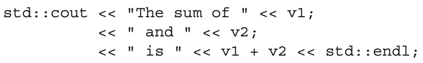

# Exercise 1.6: Explain whether the following program fragment is legal.
Exercises Section 1.2

    

If the program is legal, what does it do? If the program is not legal, why not? How would you fix it?

### Solutions:
not legal. Semicolon indicates the end of a statement. It causes the first `<<` operator in `<< " and " << v2;` lacks of left operand.

Remove the first two semicolon to fix the program.